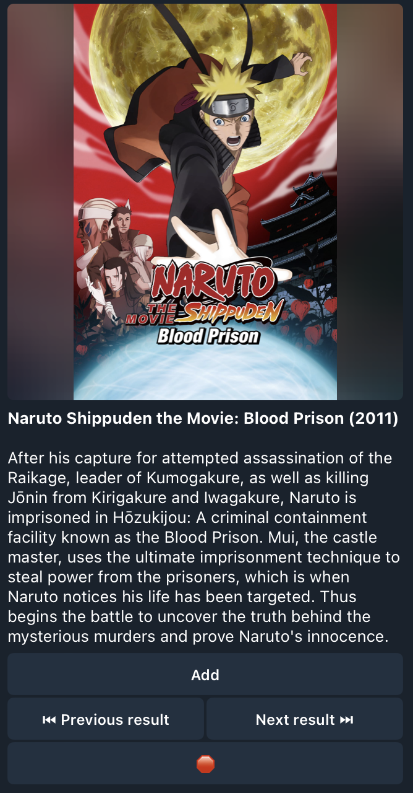
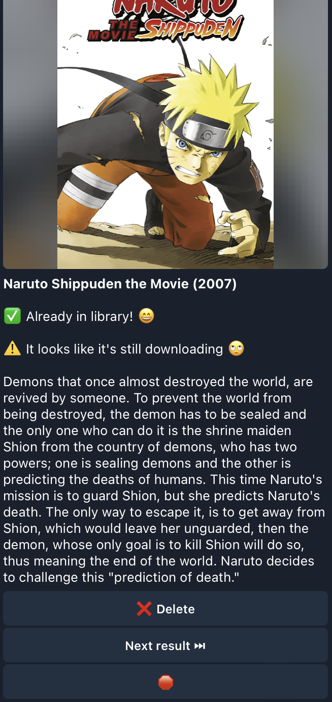

# Lookarr
Telegram bot for managing Sonarr and Radarr.

## Overview

--

## How to run
Requires env variables:
- TELEGRAM_BOT_KEY: Your telegram bot key. See [here](https://core.telegram.org/bots/tutorial) how to get yours.
- LOOKARR_AUTH_PASSWORD: Your lookarr authentication password. Set it to something strong so others can't access your app 😄

Rename config-sample.yml to config.yml before running

/auth <LOOKARR_AUTH_PASSWORD> is required when calling the bot the first time.

Adding chat ids on the "strict_mode_allowed_ids" section within the config file enables "strict mode". This means the bot will stay silent if it's contacted by users which are not in the strict_mode_allowed_ids list and they won't be able to authenticate.

Entrypoint: src/main.py
