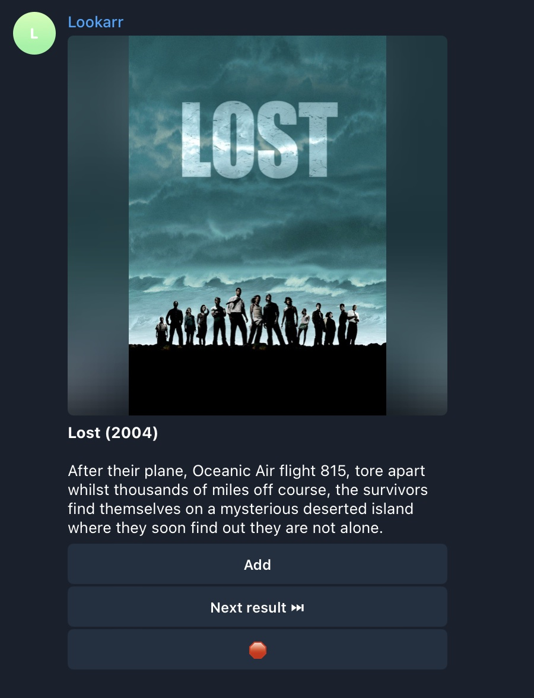
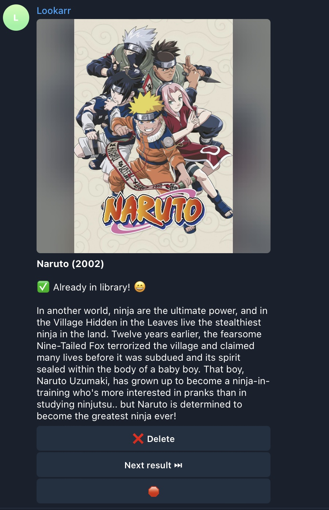
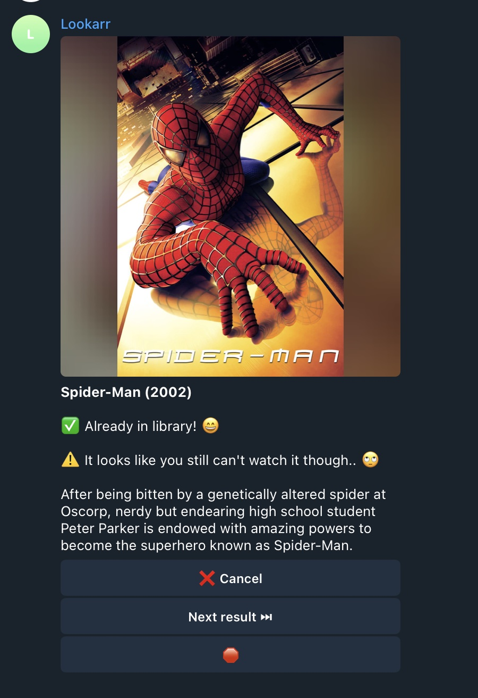

# Lookarr
Telegram bot for managing Sonarr and Radarr.

## Overview
<div>
    
<div>
</br>
<div>
    
<div>
</br>
<div>
    
<div>

## How to run with docker
Rename config-sample.yml to config.yml and set it before running

```bash
docker build -t lookarr .
docker run -e TELEGRAM_BOT_KEY=YOUR_TELEGRAM_BOT_KEY -e LOOKARR_AUTH_PASSWORD=YOUR_LOOKARR_AUTH_PASSWORD -e RADARR_API_KEY=YOUR_RADARR_API_KEY -e SONARR_API_KEY=YOUR_SONARR_API_KEY -v $(pwd)/user_config/:/app/user_config --name lookarr -d lookarr
```

- TELEGRAM_BOT_KEY: Your telegram bot key. See [here](https://core.telegram.org/bots/tutorial) how to get yours
- LOOKARR_AUTH_PASSWORD: Your lookarr authentication password. Set it to something strong so others can't access your app 😄
- RADARR_API_KEY: Your radarr api key
- SONARR_API_KEY: Your sonarr api key 

/auth <LOOKARR_AUTH_PASSWORD> is required when calling the bot the first time.

Adding chat ids on the "strict_mode_allowed_ids" section within the config file enables "strict mode". This means the bot will stay silent if it's contacted by users which are not in the strict_mode_allowed_ids list and they won't be able to authenticate.

## How to run locally
Rename config-sample.yml to config.yml and set it before running
Requires python 3.10+

```bash
export PYTHONPATH=.
export TELEGRAM_BOT_KEY=YOUR_TELEGRAM_BOT_KEY 
export LOOKARR_AUTH_PASSWORD=YOUR_LOOKARR_AUTH_PASSWORD 
export RADARR_API_KEY=YOUR_RADARR_API_KEY 
export SONARR_API_KEY=YOUR_SONARR_API_KEY

python ./src/main.py
```
